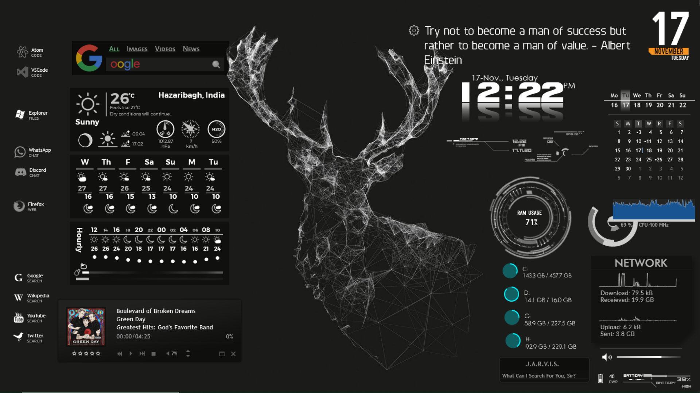
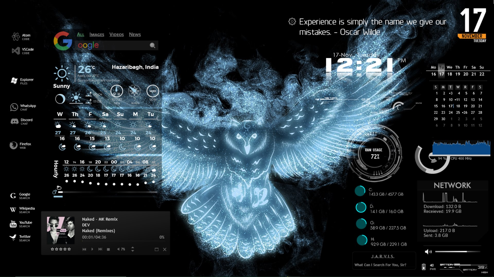

# Deer Skin
Minimalist Rainmeter Skin Optimized for The Deer Background.

### Customize your Desktop using Rainmeter :
- Go to the [Official Rainmeter Website](https://www.rainmeter.net/) and download the rainmeter on your computer.
- Download this repository and Unzip it to Documents/Rainmeter/Skins
- Open Rainmeter and enable the theme features you would like to customize.

##### Note : Rainmeter is a lightweight tool and hence does not require mass comuting power. It is very efficient and runs smoothly on all computers.

### Screenshots

---
### Show some ❤️ by starring this repository! Expecto Patronum!

##### Copyright : All of the Rainmeter Tools provided on this repo are owned by their respective developers.

